# 웹서버 구축 및 설정
## 구축 과제 내용
    - Rocky Linux 설치
    - Network 설정
        - 외부 통신을 위한 NAT 연결
        - 로컬 host pc 에서 서버로 접근하기 위한 사설 IP설정 및 ssh 포트 설정
            - 192.168.30.205 / 22
    - Apache 또는 Nginx 설정
        - 서버 소스 폴더는 임의 지정
    - http://192.168.30.205 로 접속하여 서버 확인

## 서버 설치 준비
- 서버 iso 파일 : nas/dev_data/vm/Rocky-9.2-x86_64-minimal.iso

## VM VirtualBox 설치
1. 메인 화면에서 [새로 만들기] 선택<br/>
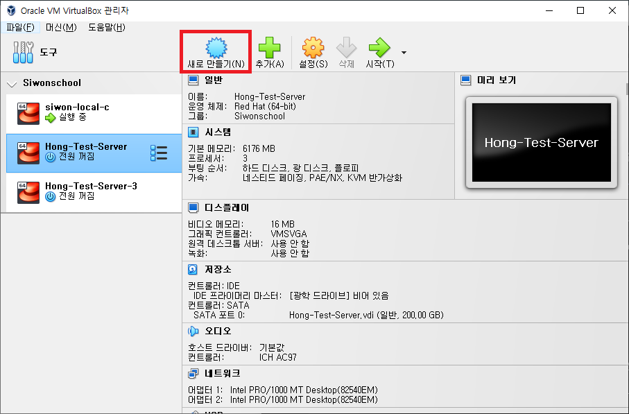
2. 가상머신 설정
    1. 가상머신 기본 설정 ( Name and Operation System )
        - 이름 : 서버 명
        - Folder : 생성된 VM 파일 저장할 경로
        - ISO Image : 설치할 OS의 iso 파일 경로
        - Edition : OS의 에디션 종류
        - 종류 : 서버 OS 종류 ( Rocky - Linux)
        - 버전 : OS의 상세 버전 ( Rocky - Red Hat ( 64 bit))
        <br/>
    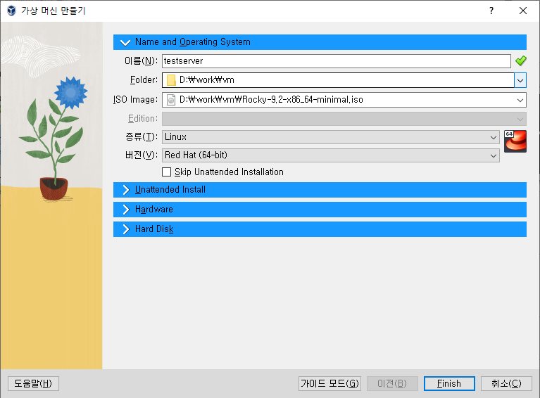
    2. 무인 설치를 위한 설정 ( Unattended Install ) ( 미사용 )
        - Username and Password : Virtural Box 를 통해 접근할 계정
        - Additainal Options : 접근을 위한 설정
        <br/>
    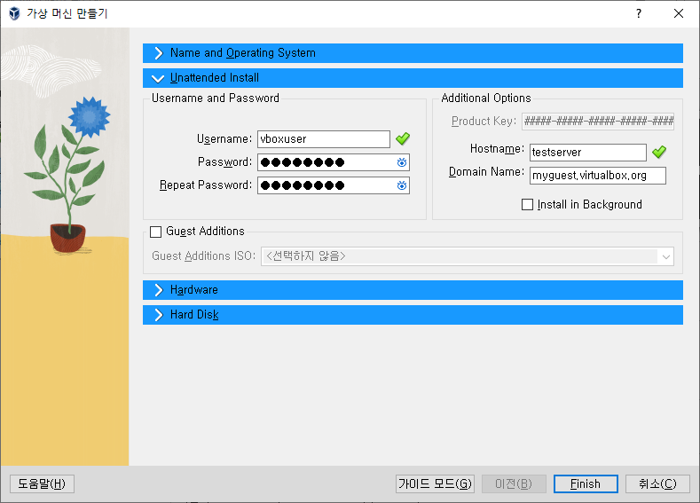
    3. 메모리 및 CPU 설정 ( Hardware )
        - 기본 메모리 : 서버의 메모리 설정 VM 가동시에 해당 메모리를 실제 호스트 PC에서 할당되어 사용하기에 적당량으로 계산하여 생성 한다 ( 1024 ~ 2048MB ( 1~2GB))
        - Prrocessors : CPU 갯수 도 동일하게 실제 호스트 PC에서 가져와 사용하기에 적당량 계산하여 생성 ( 1개 )
        <br/>
    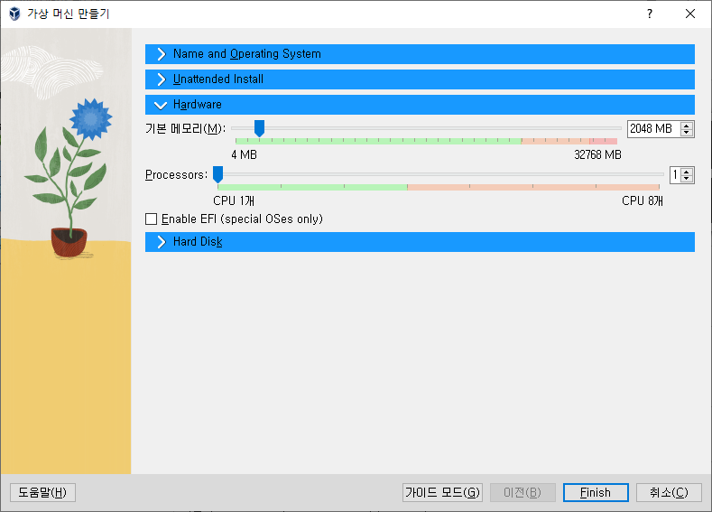
    4. 하드디스크 ( Hard Disk )
        - Create a Virtual Hard Disk Now : 신규 디스크 공간을 생성 
            - Harrd Disk File Location and Size : 신규 생성할 하드 디스크 저장 위치 와 용량 
            - Hard Disk File Type and Variant : 디스크 종류 및 디스크 공량 유동성 지정
                - Pre-allocate Full Size : 동적 할당 옵션 
                - ( 체크시 동적으로 디스크가 조절이 되서 편하나 실제 host 의 디스크를 같이 사용하기에 될 수 있으면 체크를 하지 않는 것이 좋다)
        - User an Existing Virtual Hard Disk File : 이미 만들어진 디스크를 사용
        - Do Not Add a Virtual Hard Disk : 디스크를 추가 연결하지 않음             
        <br/>
    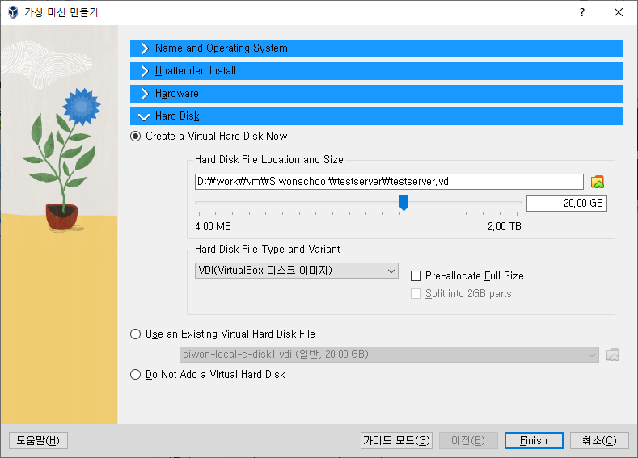
    5. 네트워크 설정
        - vm 전원이 종료된 상태에서 [설정] 으로 접근
        - [네트워크] 탭 이동
        - [어댑터 1], [어댑터 2] 네트워크 어댑터 사용하기 체크후 아래와 같이 설정 진행
            - [어댑터 1] : NAT
            - [어댑터 2] : 호스트 전용 어댑터 , VirtualBox Host-Only Ethernet Adapter
        <br/>
        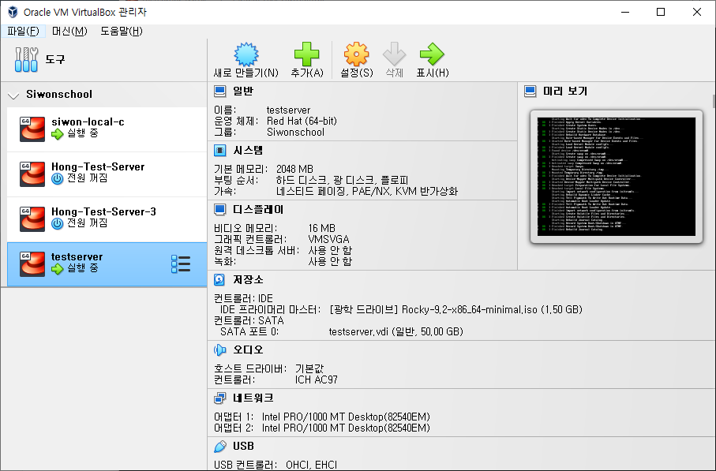
        <br/>
        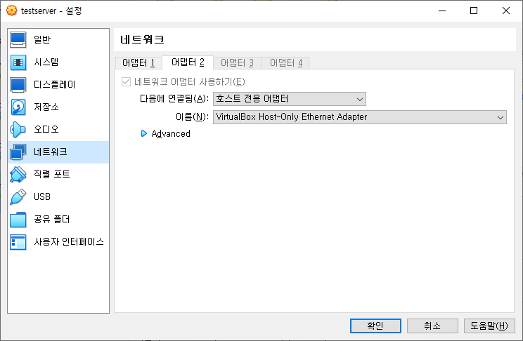
- 오류사항
    - ISOLINUX 6.04 Image checksum error
        - ISO 부팅 오류
        - 해결방법 : https://cracode.tistory.com/85

## Rocky Linux 설치
1. Install Rocky Linux 9.2 선택
    <br/>
    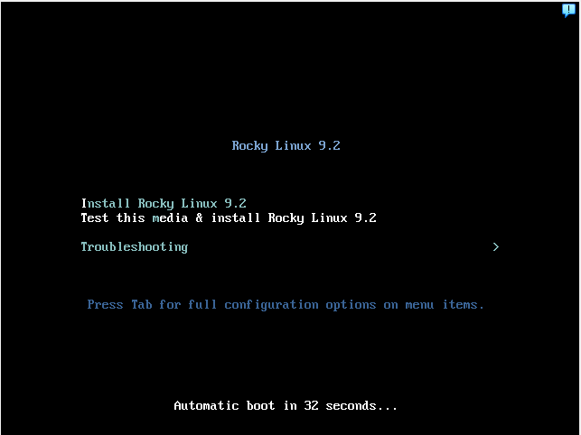
2. 언어 선택
    <br/>
    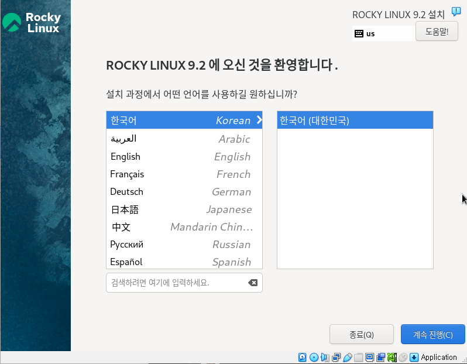
3. 설치 설정
    <br/>
    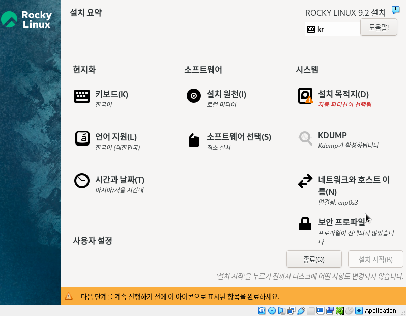
    - 현지화 : 설치시 설정할 언어 설정 및 서버 시간 설정
        - 키보드, 언어지원, 시간 : 한국 , 아시아/서울
    - 시스템 : 파티션 및 네트워크등 기본 시스템 설정
        - 설치 목적지 : 파티션 설정
            - 기본으로 설정된 [VBOX HARDDISK] 선택
            - 저장소 구성 : 자동설정
        <br/>
        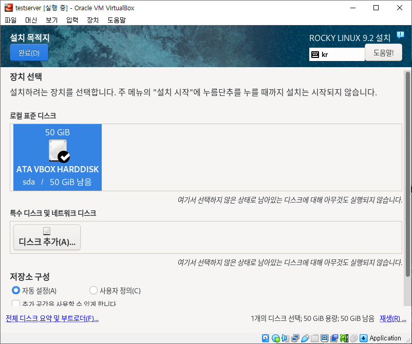
        - 네트워크와 호스트 이름 : 네트워크 기본 설정 
            - 서버설치후 설정가능하므로 패스
    - 소프트 웨어 : 설치할 OS 파티션 위치  또는 설치 소프트웨어 선택
        - 설치원천 : 로컬
        - 소프트웨어 선택 : 최소설치
    - 사용자 설정
        - root 비밀번호
        <br/>
        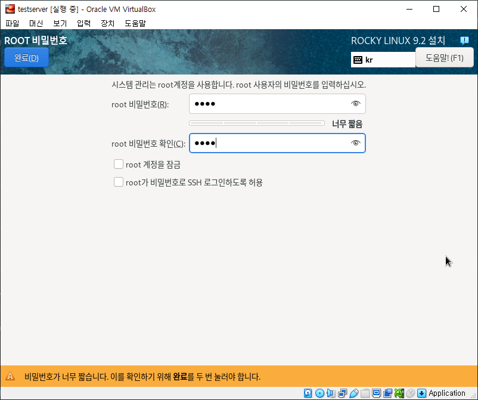
    - 모든 설정이 끝난후 [설치 시작] 선택
## 계정 추가
1. bash 에서 useradd 와 passwd 로 계정 생성 및 비밀번호 설정
```bash
// useradd {계정명}
$ useradd siwon

// passwd {계정명}
$ passwd siwon
```
## 네트워크 설정
- SSH 접속과 외부 통신을 위한 네트워크 설정
- nmtui ( NetworkManger GUI 툴 ( Rocky 이후 버전) )
1. NetworkManager 접속
```bash
$ nmtui
```
<br/>

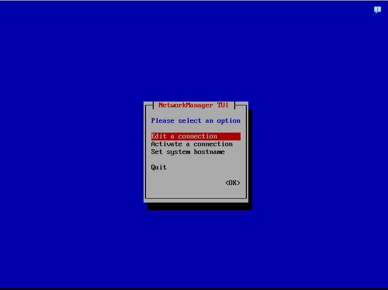
- Edit a connection : 네트워크 어댑터별 설정
- Activate a connection : 네트워크 활성 설정
- Set system hostname : 서버 호스트 네임 변경

2. [Edit a connection] 접속 
<br/>

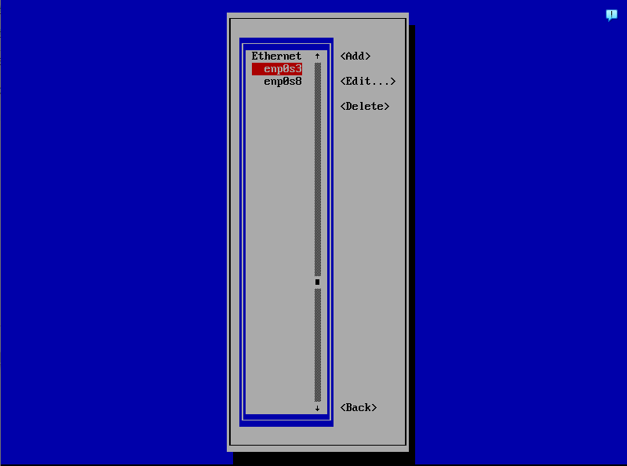
- Ethernet : 연결된 Ethernet 라인 리스트
- Add: 임의 네트워크 어댑터 추가
- Edit : 네트워크 어댑터 설정 편집
- Delete : 네트워크 삭제
    - enp0s3 : NAT 용으로 사용하기에 DHCP 로 설정
    <br/>
    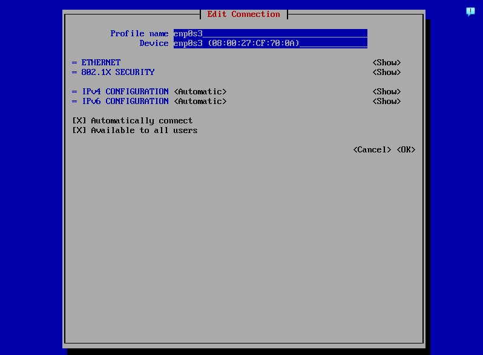
    - enp0s8 : 호스트 접근용으로 사용할 목적이기에 VM 사설 IP 설정
        - VM에 기본 Gateway가 192.168.30.1/24 로 설정되어 있을 것입니다.
        그러기에 해당 대역으로 설정
        - IP4v :  Manual
        - Address : 192.168.30.205/24 
        - Gateway : 192.168.30.1
        - DNS : 8.8.8.8
        <br/>
    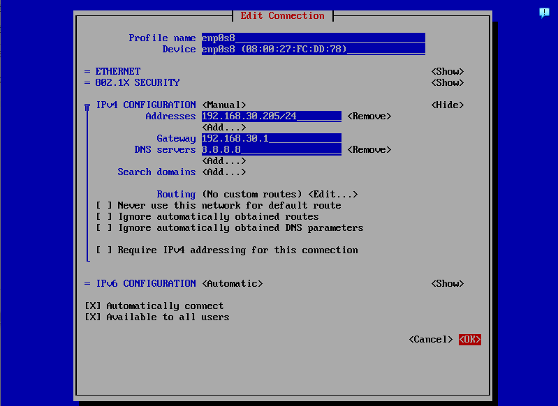
3. [Activate a connection] 접근하여 어댑터 활성화
    - 아래와 같이 설정한 어댑터에 [*](별표)가 들어가 있으면 활성화 된 상태
    - 비활성화시 선택후 <Activate> 선택하여 설정
    <br/>
    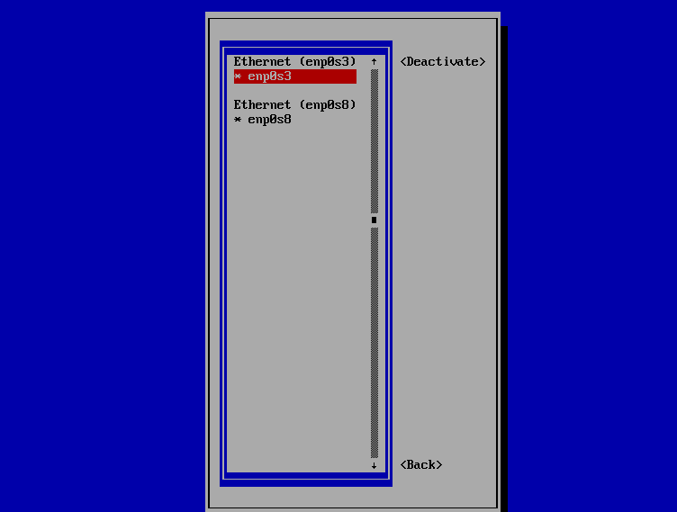
4. Quit 하여 설정 페이지 나온후 SSH 접근 확인
    <br/>
    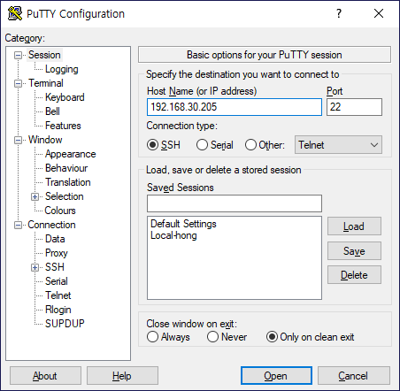
    <br/>
    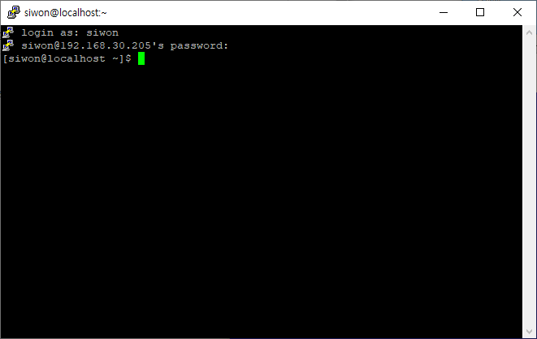

## Apache 설치
1. dnf 패키지 로 설치
```bash
// root 로 접속
// dnf 패키지 업데이트
// ( -y 옵션 : 모든 사항을 yes로 간주하고 설치한다는 옵션 )
$ dnf update -y

// apache(httpd) 설치
$ dnf install httpd -y
$ httpd -v  // 아파치 버전확인
Server version: Apache/2.4.57 (Rocky Linux)
Server built:   Jul 20 2023 00:00:00


// DB(mysql) 설치 ( clinet 접속용 )
$ dnf install mysql mysql-server -y
$ mysql -V // mysql 버전 확인 mysql 은 대문자 V 옵션
mysql  Ver 8.0.32 for Linux on x86_64 (Source distribution)

// php 설치
$ dnf install php -y

// php 버전 확인
$ dnf module list php
$ php -v

// php 8.1 을 사용하고 싶은데 다른 버전으로 설치될때
$ dnf remove php -y // php 제거
$ dnf module reset php -y  // dnf php 셋팅 초기화
$ dnf module enable php:8.1 -y  // 사용할 php 버전 활성화
$ dnf install php -y // php 설치
$ dnf module list php // 설치 버전확인
$ php -v // 실제 버전 확인
PHP 8.1.27 (cli) (built: Dec 19 2023 20:35:55) (NTS gcc x86_64)
Copyright (c) The PHP Group
Zend Engine v4.1.27, Copyright (c) Zend Technologies
    with Zend OPcache v8.1.27, Copyright (c), by Zend Technologies
```
2. 방화벽 설정( 80 / 443 )
``` bash
$ firewall-cmd --permanent --add-port=80/tcp
success
$ firewall-cmd --permanent --add-port=443/tcp
success
$ firewall-cmd --reload
success
$ firewall-cmd --list-all
public (active)
  target: default
  icmp-block-inversion: no
  interfaces: enp0s3 enp0s8
  sources: 
  services: cockpit dhcpv6-client ssh
  ports: 80/tcp 443/tcp // 이부분 포트 2개가 들어가야 정상
  protocols: 
  forward: yes
  masquerade: no
  forward-ports: 
  source-ports: 
  icmp-blocks: 
  rich rules: 
```

3. 아파치 구동
```bash 
$ systemctl start httpd
$ systemctl status httpd
● httpd.service - The Apache HTTP Server
     Loaded: loaded (/usr/lib/systemd/system/httpd.service; enabled; preset: disabled)
    Drop-In: /usr/lib/systemd/system/httpd.service.d
             └─php-fpm.conf
     Active: active (running) since Fri 2024-02-02 13:45:34 KST; 1min 28s ago
       Docs: man:httpd.service(8)
   Main PID: 49652 (httpd)
     Status: "Total requests: 0; Idle/Busy workers 100/0;Requests/sec: 0; Bytes served/sec:   0 B/sec"
      Tasks: 213 (limit: 11115)
     Memory: 30.7M
        CPU: 125ms
     CGroup: /system.slice/httpd.service
             ├─49652 /usr/sbin/httpd -DFOREGROUND
             ├─49653 /usr/sbin/httpd -DFOREGROUND
             ├─49654 /usr/sbin/httpd -DFOREGROUND
             ├─49655 /usr/sbin/httpd -DFOREGROUND
             └─49656 /usr/sbin/httpd -DFOREGROUND
```

4. 사이트 확인
- http://192.168.30.205 접속하여 아래와 같이 뜨면 정상적으로 실행 완료됨
- 소스 기본 위치는 Document Root "/var/www/html"
<br/>

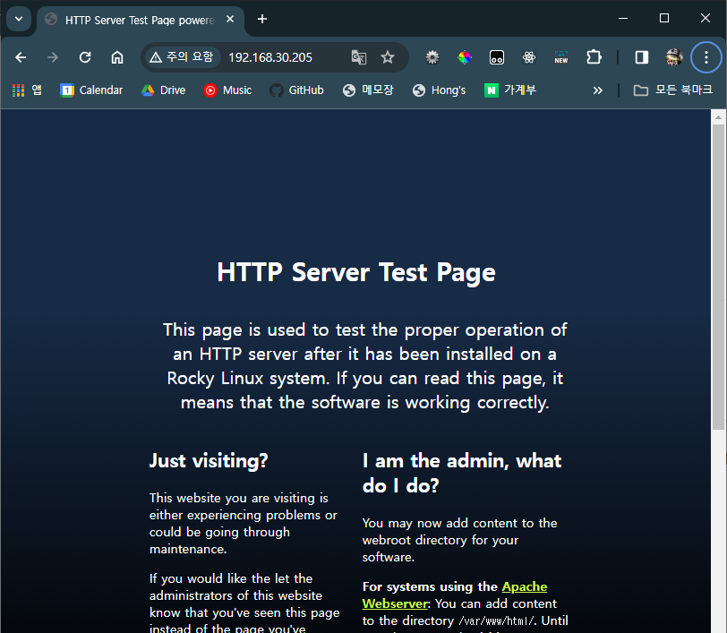


4. 아파치 conf 변경
```bash
// conf 에디터 열기
$ vi /etc/httpd/conf/httpd.conf
```

```bash
// httpd.conf
// 원하는 위치로 document root 설정
124 DocumentRoot "/var/www/html"

// index.htm index.php 추가
168 <IfModule dir_module>
169     DirectoryIndex index.html index.htm index.php
170 </IfModule>
```

``` bash
// 아파치 재시작
$ systemctl restart httpd
```